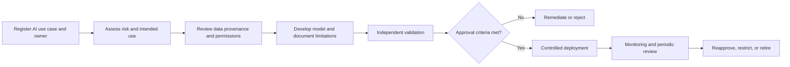

```mermaid
flowchart LR
    A["Register AI use case and owner"] --> B["Assess risk and intended use"]
    B --> C["Review data provenance and permissions"]
    C --> D["Develop model and document limitations"]
    D --> E["Independent validation"]
    E --> F{"Approval criteria met?"}
    F -->|No| G["Remediate or reject"]
    F -->|Yes| H["Controlled deployment"]
    H --> I["Monitoring and periodic review"]
    I --> J["Reapprove, restrict, or retire"]
```

[Reference](https://learn.microsoft.com/en-us/azure/machine-learning/concept-responsible-ai?view=azureml-api-2)
