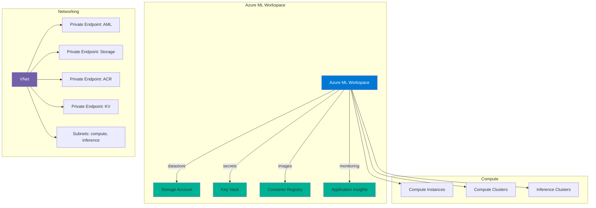

```mermaid
%% Azure ML Terraform Architecture
graph TD
    subgraph Azure ML Workspace
        AML[Azure ML Workspace] -->|datastore| SA[Storage Account]
        AML -->|secrets| KV[Key Vault]
        AML -->|images| ACR[Container Registry]
        AML -->|monitoring| AI[Application Insights]
    end

    subgraph Compute
        AML --> CI[Compute Instances]
        AML --> CC[Compute Clusters]
        AML --> IC[Inference Clusters]
    end

    subgraph Networking
        VNET[VNet] --> PE1[Private Endpoint: AML]
        VNET --> PE2[Private Endpoint: Storage]
        VNET --> PE3[Private Endpoint: ACR]
        VNET --> PE4[Private Endpoint: KV]
        VNET --> SN[Subnets: compute, inference]
    end

    style AML fill:#0078d4,color:#fff
    style SA fill:#00b294
    style KV fill:#00b294
    style ACR fill:#00b294
    style AI fill:#00b294
    style VNET fill:#7260a8,color:#fff
```