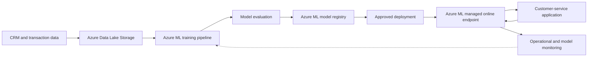

```mermaid
flowchart LR
    A["CRM and transaction data"] --> B["Azure Data Lake Storage"]
    B --> C["Azure ML training pipeline"]
    C --> D["Model evaluation"]
    D --> E["Azure ML model registry"]
    E --> F["Approved deployment"]
    F --> G["Azure ML managed online endpoint"]
    H["Customer-service application"] --> G
    G --> H
    G --> I["Operational and model monitoring"]
    I -.-> C
```
