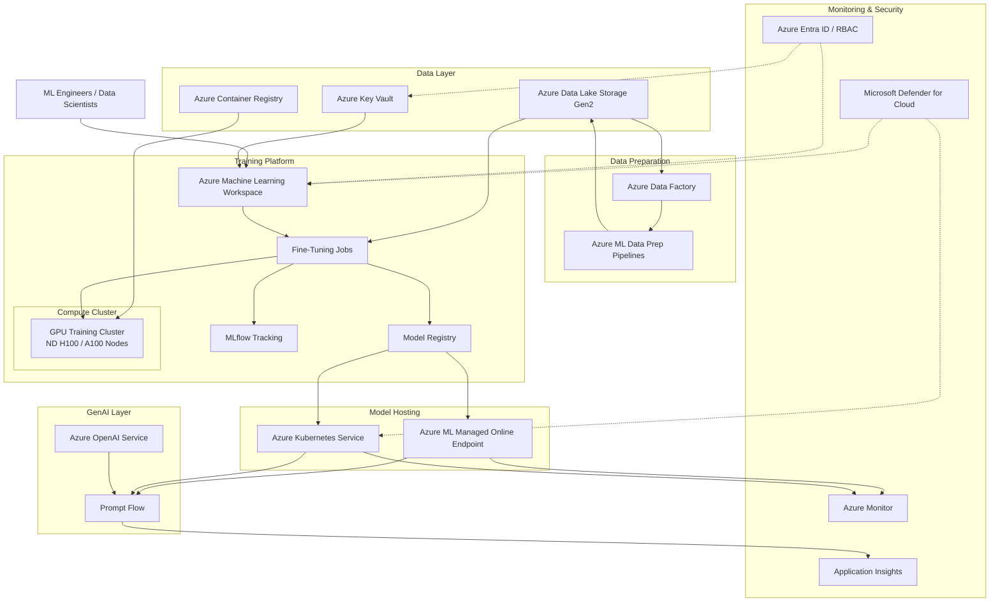

```mermaid
flowchart TB

    U[ML Engineers / Data Scientists]

    subgraph Data Layer
        ADLS[Azure Data Lake Storage Gen2]
        ACR[Azure Container Registry]
        KV[Azure Key Vault]
    end

    subgraph Data Preparation
        ADF[Azure Data Factory]
        AMLPrep[Azure ML Data Prep Pipelines]
    end

    subgraph Training Platform
        AML[Azure Machine Learning Workspace]

        subgraph Compute Cluster
            GPU[GPU Training Cluster\nND H100 / A100 Nodes]
        end

        FT[Fine-Tuning Jobs]
        Track[MLflow Tracking]
        Registry[Model Registry]
    end

    subgraph Model Hosting
        ManagedEP[Azure ML Managed Online Endpoint]
        AKS[Azure Kubernetes Service]
    end

    subgraph GenAI Layer
        AOAI[Azure OpenAI Service]
        PromptFlow[Prompt Flow]
    end

    subgraph Monitoring & Security
        AppInsights[Application Insights]
        Monitor[Azure Monitor]
        Defender[Microsoft Defender for Cloud]
        RBAC[Azure Entra ID / RBAC]
    end

    U --> AML

    ADLS --> ADF
    ADF --> AMLPrep
    AMLPrep --> ADLS

    ADLS --> FT
    ACR --> GPU
    KV --> AML

    AML --> FT
    FT --> GPU
    FT --> Track
    FT --> Registry

    Registry --> ManagedEP
    Registry --> AKS

    ManagedEP --> PromptFlow
    AKS --> PromptFlow

    AOAI --> PromptFlow

    PromptFlow --> AppInsights
    ManagedEP --> Monitor
    AKS --> Monitor

    Defender -.-> AML
    Defender -.-> AKS
    RBAC -.-> AML
    RBAC -.-> KV
```
