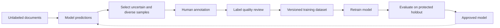

```mermaid
flowchart LR
    A["Unlabeled documents"] --> B["Model predictions"]
    B --> C["Select uncertain and diverse samples"]
    C --> D["Human annotation"]
    D --> E["Label quality review"]
    E --> F["Versioned training dataset"]
    F --> G["Retrain model"]
    G --> H["Evaluate on protected holdout"]
    H --> I["Approved model"]
    I -.-> B
```
