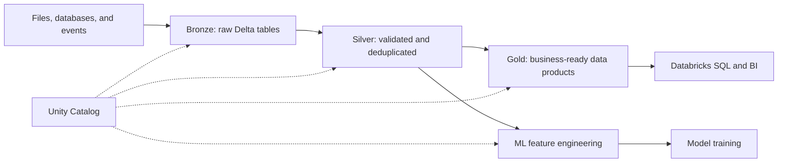

```mermaid
flowchart LR
    A["Files, databases, and events"] --> B["Bronze: raw Delta tables"]
    B --> C["Silver: validated and deduplicated"]
    C --> D["Gold: business-ready data products"]
    C --> E["ML feature engineering"]
    D --> F["Databricks SQL and BI"]
    E --> G["Model training"]
    H["Unity Catalog"] -.-> B
    H -.-> C
    H -.-> D
    H -.-> E
```

[Reference](https://learn.microsoft.com/en-us/azure/databricks/lakehouse/medallion
)
