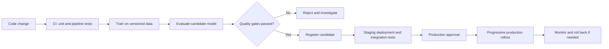

```mermaid
flowchart LR
    A["Code change"] --> B["CI: unit and pipeline tests"]
    B --> C["Train on versioned data"]
    C --> D["Evaluate candidate model"]
    D --> E{"Quality gates passed?"}
    E -->|No| F["Reject and investigate"]
    E -->|Yes| G["Register candidate"]
    G --> H["Staging deployment and integration tests"]
    H --> I["Production approval"]
    I --> J["Progressive production rollout"]
    J --> K["Monitor and roll back if needed"]
```

[Reference](https://learn.microsoft.com/en-us/azure/architecture/ai-ml/guide/machine-learning-operations-v2)
