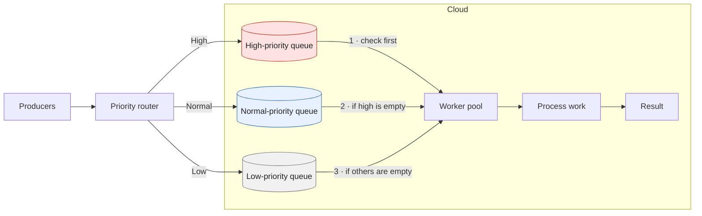

```mermaid
flowchart LR
    P[Producers] --> R[Priority router]

    subgraph Cloud["Cloud"]
        direction LR
        HQ[(High-priority queue)]
        NQ[(Normal-priority queue)]
        LQ[(Low-priority queue)]

        HQ -->|1 · check first| W[Worker pool]
        NQ -->|2 · if high is empty| W
        LQ -->|3 · if others are empty| W

        W --> S[Process work]
        S --> D[Result]
    end

    R -->|High| HQ
    R -->|Normal| NQ
    R -->|Low| LQ

    classDef priority fill:#fde2e2,stroke:#c0392b,color:#222
    classDef standard fill:#e8f1ff,stroke:#3973ac,color:#222
    classDef low fill:#f1f1f1,stroke:#777,color:#222
    class HQ priority
    class NQ standard
    class LQ low
```  
